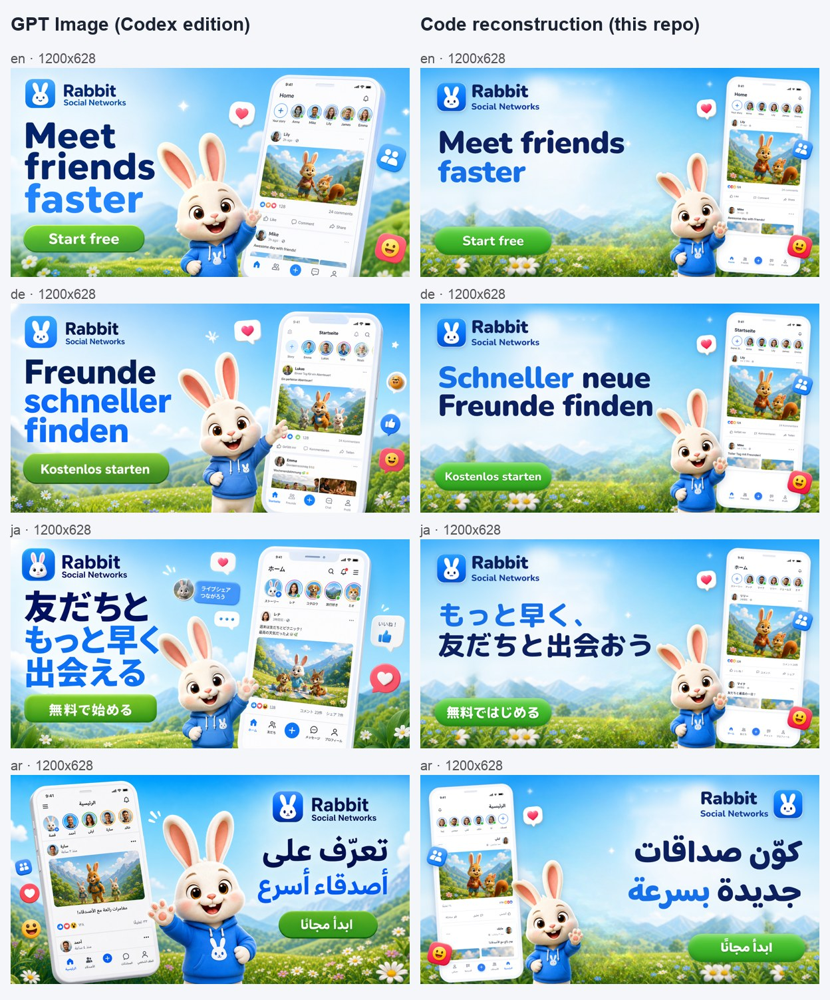
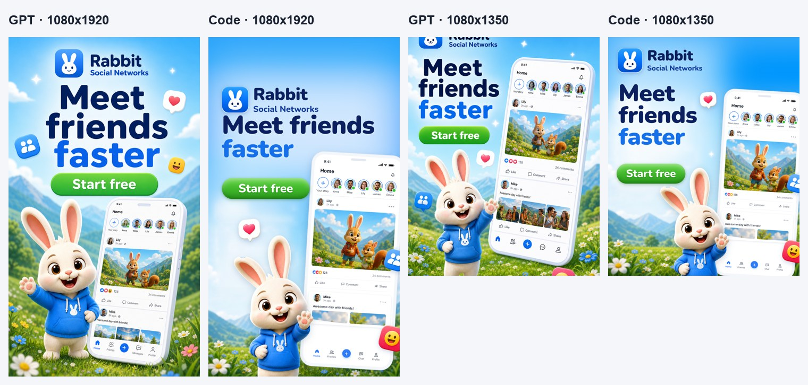
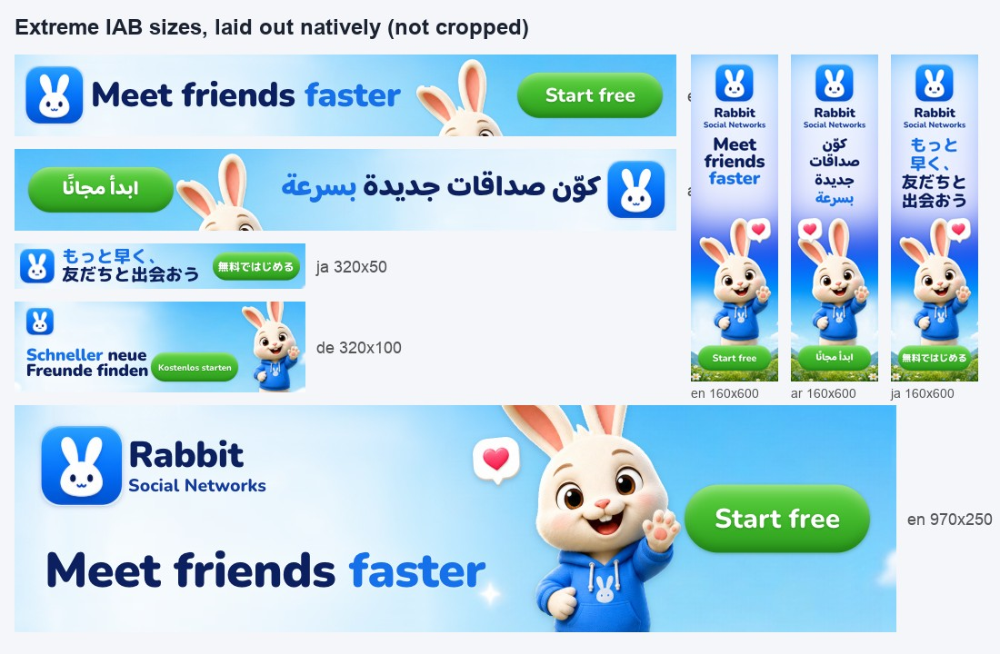
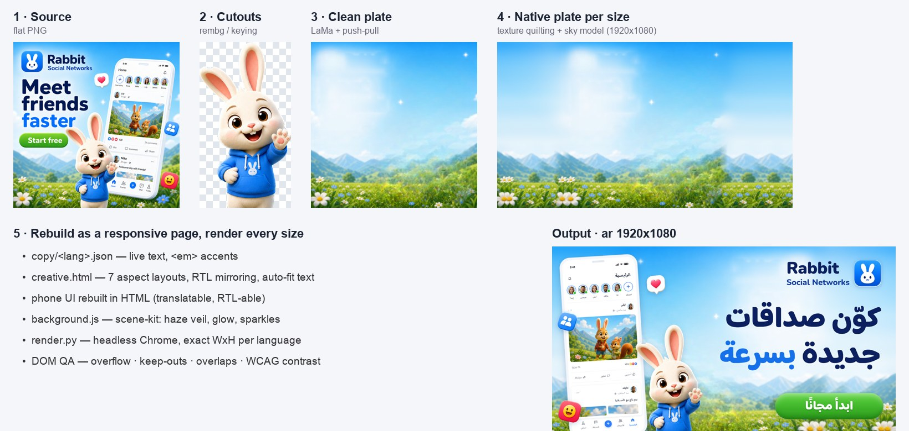
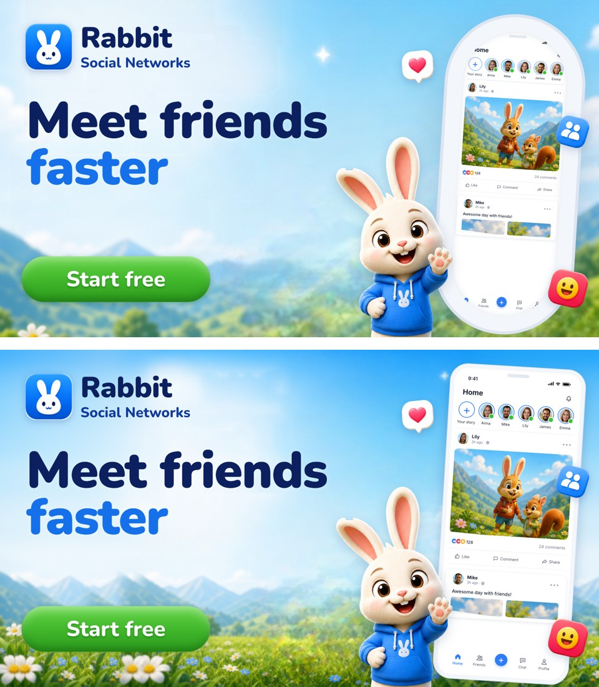
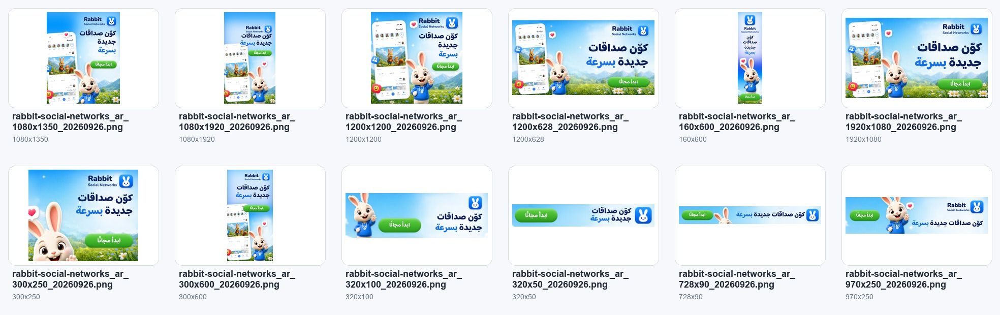

# Ad Image Localization: code edition

**Localize and resize ad creatives with a coding agent and no image model.**

[中文](./README.zh-CN.md) · [SKILL.md](./skills/ad-image-localization/SKILL.md) · [Example](./skills/ad-image-localization/examples/rabbit-social-networks/) · [GPT-Image edition](https://github.com/kouzt123/ad-image-localization-codex)

This is the sibling of [ad-image-localization-codex](https://github.com/kouzt123/ad-image-localization-codex), which repaints every language and size with GPT Image. This edition was built for coding agents that **can't generate images**, and it leans entirely on what they *are* good at: writing code. The agent takes the ad apart into layers, rebuilds it as a responsive HTML page with live text, and renders every language × size in headless Chrome.

**To be upfront: it doesn't match GPT Image.** The GPT edition re-imagines the composition for each format; this one re-arranges the pieces of the original. Within that constraint the results are already good, and a few things (correct text, extreme banner sizes, automated QA, instant re-renders) it does better. The honest comparison is below.



*Left: GPT-Image edition. Right: this repo. Same campaign, same target size. The code edition started from the GPT edition's 1200x1200 English image as its only input.*

---

## Where it falls short of the GPT-Image edition

These are all visible in the rabbit example above and below.

1. **No re-composition per format.** GPT Image redraws the scene for each ratio. In 9:16 it shows the whole rabbit and a much larger headline; in 1200x628 it stacks the headline into three big lines. The code edition keeps the source's composition and moves, scales and drops pieces. That works, but tall and wide formats feel more templated, and subjects get cropped (the rabbit's legs are cut off in 9:16).
2. **Subjects are frozen.** A cutout can be moved and scaled, never re-posed, turned or extended. Anything cropped out of the source (a leg, the edge of a product) can't be drawn back.
3. **Background where subjects used to be.** Areas the subjects covered are filled by LaMa inpainting and come out softer than the rest. New canvas area is built from real texture (see *Background*), but texture quilting can repeat distinctive objects, such as a big daisy showing up twice.
4. **Rebuilt UI is flat.** The phone mockup is rebuilt in HTML so its text can be translated and mirrored for RTL. It loses the 3D render's lighting and depth. The GPT edition also *re-localizes the content* inside the phone: Japanese names, a different post photo, Arabic-speaking users. The code edition swaps text only; the photos stay the same.
5. **Lettering style.** GPT re-letters in the source's style. The code edition sets text in the closest Google Font. Text printed on curved or 3D surfaces (packaging, clothing) can only be patched flat, or left untranslated.
6. **No new imagery.** GPT adds localized touches such as extra stickers or culture-specific details. Here, code only draws light and vector elements: haze, glows, sparkles, gradients and flat shapes. We tried drawing a whole painterly background in code, and next to a 3D-rendered character it read as clip-art.
7. **Agent effort per creative.** The first reconstruction of a new creative takes tens of minutes of agent work: measuring, writing `scene.json`, writing the HTML, then iterating on renders. Quality depends on the agent's design judgement. With GPT Image it's one prompt per image.
8. **Heavy local setup.** About 1.5 GB of Python dependencies (torch, onnxruntime), about 380 MB of models (rembg, LaMa), and Google Chrome.

## Where it is better

- **Text is always right.** Real fonts mean no misspelled or melted glyphs, correctly joined Arabic, and phrase-aware Japanese line breaks. (The GPT edition's own README notes that image generation "can still distort small text, logos, hands, faces, or dense UI".)
- **Pixel-identical brand assets.** The logo, character and product are cut from the source, not redrawn.
- **Extreme sizes are exact and repeatable.** Both editions take formats like `320x50`, `728x90` and `160x600` seriously. The GPT edition picks the nearest safe ratio, crops deterministically, and has the model re-extend or re-lay out the creative when a crop would hurt it. Its re-layouts are more inventive. The code edition's advantage is precision: each size is an explicit layout rule, so type stays crisp and correctly spelled even at 50 px tall, and every language re-renders identically.
- **Deterministic and re-renderable.** `creative.html` + `copy/<lang>.json` is an editable master. Adding a language means adding one JSON file, and 48 renders take about a minute.
- **Automated QA on every render:** text overflow, off-canvas text, type size, overlaps, text over faces or products (alpha-aware), story safe zones, and **WCAG contrast against the pixels actually behind the text**. A recorded visual review and a release gate come on top.
- **No image model or API.** Everything runs locally.





---

## How it works



1. **Recognize.** The agent views the source and measures every element on a labelled coordinate grid (`decompose.py grid`, `crop`, `rotate` for tilted UI).
2. **Decompose.** `scene.json` → `decompose.py decompose` produces the transparent cutouts (rembg or colour keying), a clean plate with the text and subjects removed (LaMa for texture, push-pull for smooth sky or gradients), and `layers.json`.
3. **Native background per size.** `decompose.py extend` builds one exact-size plate per delivery size. Taller sizes continue the sky with a C1-continuous gradient model. Wider sizes quilt the ground band sideways from *untouched* source pixels. Thin strips use a cover crop. Light layers (the source's legibility haze, glows, sparkles) are drawn in code with `scene-kit.js`, per layout. For flat, vector or gradient sources the whole background can be drawn in code.
4. **Rebuild.** The agent writes `creative.html` with 7 aspect layouts (strip, billboard, landscape, square, portrait, story, skyscraper), CSS logical properties so RTL mirrors automatically, auto-fitting text, and UI mockups rebuilt in HTML.
5. **Render and QA.** `render.py` renders every language × size in headless Chrome and collects DOM QA. The agent then reviews per-language contact sheets. Culture-aware QA, the manifest and `release-check` close the loop.

| Source background | Strategy |
|---|---|
| Flat colour, gradient, vector, bokeh | Redraw entirely in code (`scene-kit.js`): pixel-perfect at any size |
| Painterly or photographic ground + sky (the rabbit) | `extend`: quilt real texture, model the sky, add code-drawn light |
| Structured scene (room, street) | Plate + cover crop; ask for a layered PSD/Figma file for best results |

*Before (top): one plate stretched to 16:9. After (bottom): a native 1920x1080 plate with quilted real texture and the source's haze panel re-drawn in code.*



*All 12 sizes, Arabic (RTL):*



---

## Works with any capable coding agent

The skill uses the [Agent Skills](https://agentskills.io) `SKILL.md` format, and all the heavy lifting is plain Python and HTML. **Requirements:** an agent that can run shell commands, edit files and **view images** (visual review is mandatory), on macOS or Linux, with Python 3.10+ (`uv` recommended) and Google Chrome (or Playwright's Chromium).

**Claude Code**

```text
/plugin marketplace add kouzt123/ad-image-localization
/plugin install ad-image-localization@kouzt123-ad-image-localization
```

**Codex**

```bash
codex plugin marketplace add kouzt123/ad-image-localization
codex plugin add ad-image-localization@kouzt123-ad-image-localization
```

**Other agents that support `SKILL.md`:** copy or symlink `skills/ad-image-localization/` into the agent's skills directory.

**Agents without skill support:** open this repo; `AGENTS.md` points the agent at `SKILL.md`. Or just tell the agent: *"Read skills/ad-image-localization/SKILL.md and follow it."*

Then, once:

```bash
bash skills/ad-image-localization/scripts/setup.sh    # creates the skill's .venv
```

## Usage

> Localize this ad into German, Japanese and Arabic, full-pack sizes: `/path/to/ad.png`

> 把这张图本地化成葡萄牙语，品牌名不翻译，输出 1200x1200、1080x1920 和 320x50。

Delivery profiles (`references/delivery_profiles.json`): `standard-delivery` (1:1, 16:9, 4:5, 9:16, 1.91:1), `social-core`, `google-ads-image-assets`, `iab-display` (300x250, 728x90, 320x50, 320x100, 160x600, 300x600, 970x250), and `full-pack`.

Every job gets its own run folder:

```text
ad-localization-runs/<slug>_<yyyymmdd_hhmm>/
├── source/  scene.json  creative.html  background.js  copy/<lang>.json  job.json
├── final/                       upload-ready files: <slug>_<lang>_<WxH>_<date>.png
├── qa/                          preflight, render_qa, manifest, contact sheets, visual_review
├── work/layers/                 cutouts, plate, plates/plate_<WxH>.png
└── Flagged by Culture-Aware QA/
```

## Repository layout

```text
skills/ad-image-localization/
├── SKILL.md                     the workflow the agent follows
├── scripts/decompose.py         grid · crop · rotate · decompose · extend
├── scripts/render.py            HTML → PNG per language × size + DOM QA
├── scripts/ad_image_localization_tools.py   preflight · manifest · verify · contact-sheet · qa-init · release-check · culture flags · term memory
├── templates/                   ad-runtime.js · scene-kit.js · creative/background templates
├── references/                  delivery profiles · job schema
└── examples/rabbit-social-networks/   full worked example
.claude-plugin/ .codex-plugin/ .agents/   plugin manifests
AGENTS.md / CLAUDE.md            entry point for agents
tests/ evals/                    unit tests and preflight eval cases
```

```bash
skills/ad-image-localization/.venv/bin/python -m unittest discover -s tests
```

## License

MIT © kouzt123. Built with Claude Code.
